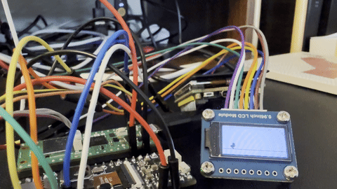

# Rust RPico2 Discovery

This repository contains examples for the Raspberry Pi Pico 2 board, written in Rust.

## Project generated

```shell
cargo generate --git https://github.com/ImplFerris/pico2-template.git --name rust-rpico2-discovery
```

## Hardware

**Board:** Raspberry Pi Pico 2

- **MCU:** RP2350 (Dual-core Arm Cortex-M33 and RISC-V cores)
- **On-board peripherals:**
  - LED on GPIO25

### Pinout


### Common Pin Assignments

- **I2C pins:**
  - **I2C0 SDA:** GPIO4
  - **I2C0 SCL:** GPIO5
  - **I2C1 SDA:** GPIO2
  - **I2C1 SCL:** GPIO3
- **UART pins:**
  - **UART0 TX:** GPIO0, **UART0 RX:** GPIO1
  - **UART1 TX:** GPIO8, **UART1 RX:** GPIO9

## Examples

### Camera Examples

#### ov5640_ili9341_stream

Streams live video from an OV5640 camera to an ILI9341 SPI display.

**Note on Performance:** This example must be compiled with optimizations (e.g. `--release`) to keep up with the 16MHz camera clock.

```bash
cargo run --example ov5640_ili9341_stream --release
```

**Wiring (Adafruit PiCowbell Camera + ILI9341 Display Breakout):**

| Component | Function | GPIO | Pico Pin |
|-----------|----------|------|----------|
| **OV5640**| VSync    | 0    | 1        |
|           | Power DN | 1    | 2        |
|           | HRef     | 2    | 4        |
|           | PCLK     | 3    | 5        |
|           | I2C SDA  | 4    | 6        |
|           | I2C SCL  | 5    | 7        |
|           | D0-D7    | 6-13 | 9-17     |
|           | Reset    | 14   | 19       |
|           | XCLK     | NC   | -        |
| **ILI9341**| SCK     | 18   | 24       |
|           | MOSI     | 19   | 25       |
|           | MISO     | 16   | 21       |
|           | CS       | 17   | 22       |
|           | Reset    | 21   | 27       |
|           | DC       | 20   | 26       |

> [!NOTE]
> The Adafruit PiCowbell Camera Breakout uses its own onboard 16MHz oscillator. Do not connect Pico GPIOs to the XCLK pin unless you have cut the XCLK jumper on the breakout.

### Basic Examples

#### blinky

Blinks the on-board LED on GPIO25 to verify your setup is working.

```bash
cargo run --example blinky
```

#### blinky_pico2w (Pico 2 W)

Blinks the onboard LED of the Raspberry Pi Pico 2 W. Unlike the standard Pico 2, the onboard LED on the Pico 2 W is connected to the CYW43439 wireless chip.

1. Run `./download_firmware.sh` to get the required blobs from the official Embassy repo.
2. Run the example: `cargo run --example blinky_pico2w`

#### wifi_scan_pico2w (Pico 2 W)

Scans for nearby WiFi networks using the CYW43439 wireless chip.

1. Run `./download_firmware.sh` to get firmware.
2. Run: `cargo run --example wifi_scan_pico2w`

#### ble_scan_pico2w (Pico 2 W)

Scans for nearby Bluetooth Low Energy (BLE) devices.

1. Run `./download_firmware.sh` to get firmware.
2. Run: `cargo run --example ble_scan_pico2w`

### Why Embassy for Pico 2 W?

The Pico 2 W features the CYW43439 wireless chip, which is complex and requires specialized communication. Embassy is used because:

- **Async/Await**: The `cyw43` driver is non-blocking, allowing concurrent WiFi, Bluetooth, and application logic.
- **DMA & PIO**: Embassy leverages the RP2350's PIO and DMA for the custom SPI interface needed for wireless.
- **Power Savings**: The executor automatically sleeps the chip during idle periods.
- **Modern Stacks**: Provides direct integration with `embassy-net` (TCP/IP) and `trouble` (BLE).

### ADC Examples

#### grove_light_sensor_adc

Reads an analog value from a Grove Light Sensor v1.2.

```bash
cargo run --example grove_light_sensor_adc
```

**Wiring:**

The Grove Light Sensor is an analog sensor and must be connected to an ADC pin.
On the Raspberry Pi Pico 2, ADC pins are GPIO26, GPIO27, and GPIO28.

```
          Raspberry Pi Pico 2
        +--------------------------+
        |                          |
        | [ ] 1   40 [ ] USB       |
        | [ ] 2   39 [ ]           |
        | [ ] 3   38 [G]ND --------+ (black)
        | [ ] 4   37 [ ]           |
        | [ ] 5   36 [3]V3(OUT) ---+ (red)
        | [ ]...  ...[ ]           |
        | [ ]...  ...[ ]           |
        | [ ] 30  31 [A]GPIO26 ----+ (yellow)
        | [ ] 29  32 [ ]           |
        | [ ]...  ...[ ]           |
        | [ ]...  ...[ ]           |
        +--------------------------+
               |   |   |
               |   |   |
        +------|---|---|------------+
        |      G   V   S           |
        |      N   C   I           |
        |      D   C   G           |
        |                          |
        |  Grove Light Sensor v1.2 |
        +--------------------------+
```

**Connections:**

- **GND (black wire):** Connects to any `GND` pin on the Pico 2 (Pin 38 is a convenient choice).
- **VCC (red wire):** Connects to the `3V3(OUT)` pin on the Pico 2 (Pin 36).
- **SIG (yellow wire):** Connects to an ADC-capable pin. In the example code, this is `GPIO26` (Pin 31).

#### grove_moisture_sensor_adc

Reads an analog moisture sensor value and prints it to the console with an interpretation.

```bash
cargo run --example grove_moisture_sensor_adc
```

**Wiring:**

The Grove Moisture Sensor is an analog sensor and must be connected to an ADC pin.
On the Raspberry Pi Pico 2, ADC pins are GPIO26, GPIO27, and GPIO28.

```
          Raspberry Pi Pico 2
        +--------------------------+
        |                          |
        | [ ] 1   40 [ ] USB       |
        | [ ] 2   39 [ ]           |
        | [ ] 3   38 [G]ND --------+ (black)
        | [ ] 4   37 [ ]           |
        | [ ] 5   36 [3]V3(OUT) ---+ (red)
        | [ ]...  ...[ ]           |
        | [ ]...  ...[ ]           |
        | [ ] 30  31 [ ]           |
        | [ ] 29  32 [A]GPIO27 ----+ (yellow)
        | [ ]...  ...[ ]           |
        | [ ]...  ...[ ]           |
        +--------------------------+
               |   |   |
               |   |   |
        +------|---|---|------------+
        |      G   V   S           |
        |      N   C   I           |
        |      D   C   G           |
        |                          |
        |   Grove Moisture Sensor  |
        +--------------------------+
```

**Connections:**

- **GND (black wire):** Connects to any `GND` pin on the Pico 2 (Pin 38 is a convenient choice).
- **VCC (red wire):** Connects to the `3V3(OUT)` pin on the Pico 2 (Pin 36).
- **SIG (yellow wire):** Connects to an ADC-capable pin. In this example, this is `GPIO27` (Pin 32, ADC1).

### I2C Examples

#### i2c_scan

Scans both I2C buses (`I2C0` and `I2C1`) for connected devices and prints their addresses. This is useful for debugging I2C connections and discovering device addresses.

```bash
cargo run --example i2c_scan
```

**Wiring:**

You can connect I2C devices to either or both of the default I2C ports.

- **I2C0:**
  - SDA: GPIO4 (Pin 6)
  - SCL: GPIO5 (Pin 7)
- **I2C1:**
  - SDA: GPIO2 (Pin 4)
  - SCL: GPIO3 (Pin 5)

#### bme280_i2c

Reads temperature, humidity, and atmospheric pressure from an external BME280 sensor. This example is configured for devices on `I2C0` with an address of `0x77`.

```bash
cargo run --example bme280_i2c
```

**Wiring:**

```
BME280 Pin -> RPi Pico 2
----------    --------------
GND (black) -> GND
VCC (red)   -> 3.3V
SCL (yellow)-> GPIO5 (Pin 7)
SDA (blue)  -> GPIO4 (Pin 6)
```

**I2C Address:**

- **0x77**: Used by default in this example (`BME280::new_secondary()`). Common on Adafruit BME280 boards.
- **0x76**: Can be used by changing the code to `BME280::new_primary()`.

#### bmp280_i2c

Reads temperature and atmospheric pressure from an external BMP280 sensor. This example is configured for devices on `I2C0` with an address of `0x77`.

```bash
cargo run --example bmp280_i2c
```

**Wiring:**

```
BMP280 Pin -> RPi Pico 2
----------    --------------
GND (black) -> GND
VCC (red)   -> 3.3V
SCL (yellow)-> GPIO5 (Pin 7)
SDA (blue)  -> GPIO4 (Pin 6)
```

**I2C Address:**

- **0x77**: Used by default in this example (`BMP280::new_secondary()`). Common on Adafruit BMP280 boards.
- **0x76**: Can be used by changing the code to `BMP280::new_primary()`.

#### hs3003_i2c

Reads temperature and humidity from an HS3003 sensor using a custom driver on the Raspberry Pi Pico 2. This example is configured for devices on `I2C0` with a fixed address of `0x44`.

```bash
cargo run --example hs3003_i2c
```

**Wiring:**

```
HS3003 Pin -> RPi Pico 2
----------    --------------
GND (black) -> GND
VCC (red)   -> 3.3V
SCL (yellow)-> GPIO5 (Pin 7) (I2C0 SCL)
SDA (blue)  -> GPIO4 (Pin 6) (I2C0 SDA)
```

#### bh1750_i2c

Reads ambient light levels in lux from an external BH1750 sensor. This example is configured for devices on `I2C0` with an address of `0x23`.

```bash
cargo run --example bh1750_i2c
```

**Wiring:**

```
BH1750 Pin -> RPi Pico 2
----------    --------------
GND (black) -> GND
VCC (red)   -> 3.3V
SCL (yellow)-> GPIO5 (Pin 7)
SDA (blue)  -> GPIO4 (Pin 6)
```

**I2C Address:**

- **0x23**: (ADDR pin to GND) - Used by default in this example.
- **0x5C**: (ADDR pin to VCC) - Can be used by changing `Address::Low` to `Address::High` in the code.

#### modulino_pixels_i2c

Controls the 8 RGB LEDs on an Arduino Modulino Pixels module, demonstrating various color animations. This example is configured for devices on `I2C0` with an address of `0x36`.

```bash
cargo run --example modulino_pixels_i2c
```

**Wiring:**

```
Modulino Pin -> RPi Pico 2
------------    --------------
GND (black)  -> GND
VCC (red)    -> 3.3V
SCL (yellow) -> GPIO5 (Pin 7)
SDA (blue)   -> GPIO4 (Pin 6)
```

#### vl53l4cd_i2c

Reads distance from a VL53L4CD Time-of-Flight Distance Sensor using a blocking driver. This example is configured for devices on `I2C0` with a fixed address of `0x29`.

```bash
cargo run --example vl53l4cd_i2c
```

**Wiring:**

```
VL53L4CD Sensor -> RPi Pico 2
---------------    --------------
GND (black)     -> GND
VCC (red)       -> 3.3V
SCL (yellow)    -> GPIO5 (Pin 7)
SDA (blue)      -> GPIO4 (Pin 6)
```

**Resources:**

- [Arduino Modulino Distance documentation](https://docs.arduino.cc/hardware/modulino-distance/)

#### dht20_i2c

Reads temperature and humidity from a DHT20 sensor. This example is configured for devices on `I2C0` with an address of `0x38`.

```bash
cargo run --example dht20_i2c
```

**Wiring:**

```
DHT20 Pin -> RPi Pico 2
----------    --------------
GND (black) -> GND
VCC (red)   -> 3.3V
SCL (yellow)-> GPIO5 (Pin 7)
SDA (blue)  -> GPIO4 (Pin 6)
```

#### aht30_i2c

Reads temperature and humidity from an AHT30 sensor over I2C0 using the Qwiic connector. This example is configured for devices on `I2C0` with a default address of `0x38`.

```bash
cargo run --example aht30_i2c
```

**Wiring with Qwiic/STEMMA QT:**

```
   Sensor Pin -> RPi Pico 2
-------------    --------------
GND (black)   -> GND
VCC (red)     -> 3.3V
SCL (yellow)  -> GPIO5 (Pin 7) (I2C0 SCL)
SDA (blue)    -> GPIO4 (Pin 6) (I2C0 SDA)
```


#### lis3dh_i2c

Reads accelerometer data from a LIS3DH sensor. This example is configured for devices on `I2C0` with an address of `0x19`.

```bash
cargo run --example lis3dh_i2c
```

**Wiring:**

```
LIS3DH Pin -> RPi Pico 2
----------    --------------
GND (black) -> GND
VCC (red)   -> 3.3V
SCL (yellow)-> GPIO5 (Pin 7)
SDA (blue)  -> GPIO4 (Pin 6)
```

#### adxl345_i2c

Reads accelerometer data from an ADXL345 sensor over I2C. This example is configured for devices on `I2C0` with an address of `0x53`.

```bash
cargo run --example adxl345_i2c
```

**Wiring:**

```
ADXL345 Pin -> RPi Pico 2
-----------    --------------
GND (black) -> GND
VCC (red)   -> 3.3V
SCL (yellow)-> GPIO5 (Pin 7)
SDA (blue)  -> GPIO4 (Pin 6)
```

#### bmp580_i2c

Reads atmospheric pressure and temperature from an Adafruit BMP580 sensor over I2C. This example is configured for devices on `I2C0` with an address of `0x47`.

```bash
cargo run --example bmp580_i2c
```

**Wiring:**

```
BMP580 Pin -> RPi Pico 2
----------    --------------
GND (black) -> GND
VCC (red)   -> 3.3V
SCL (yellow)-> GPIO5 (Pin 7)
SDA (blue)  -> GPIO4 (Pin 6)
```

#### bme680_i2c

Reads temperature, humidity, atmospheric pressure, and gas resistance (VOCs) from a BME680/BME688 sensor over I2C. This example is configured for devices on `I2C0` with an address of `0x77`.

```bash
cargo run --example bme680_i2c
```

**Wiring:**

```
BME680 Pin -> RPi Pico 2
----------    --------------
GND (black) -> GND
VCC (red)   -> 3.3V
SCL (yellow)-> GPIO5 (Pin 7)
SDA (blue)  -> GPIO4 (Pin 6)
```

#### sgp30_i2c

Reads eCO2 (equivalent CO2) and TVOC (Total Volatile Organic Compounds) from an SGP30 air quality sensor over I2C. This example is configured for devices on `I2C0` with a fixed address of `0x58`.

```bash
cargo run --example sgp30_i2c
```

**Wiring:**

```
SGP30 Pin -> RPi Pico 2
----------    --------------
GND (black) -> GND
VCC (red)   -> 3.3V
SCL (yellow)-> GPIO5 (Pin 7)
SDA (blue)  -> GPIO4 (Pin 6)
```

**Note:** The measure() function must be called every 1 second for proper baseline compensation.

#### scd40_i2c

Reads CO2 concentration, temperature, and humidity from an SCD40 sensor over I2C. This example is configured for devices on `I2C0` with a fixed address of `0x62`.

```bash
cargo run --example scd40_i2c
```

**Wiring:**

```
SCD40 Pin -> RPi Pico 2
----------    --------------
GND (black) -> GND
VCC (red)   -> 3.3V
SCL (yellow)-> GPIO5 (Pin 7) (I2C0 SCL)
SDA (blue)  -> GPIO4 (Pin 6) (I2C0 SDA)
```

#### sths34pf80_i2c

Reads presence, motion, and raw infrared intensity from an STHS34PF80 sensor over I2C0.

```bash
cargo run --example sths34pf80_i2c
```

**Wiring:**

``` text
     STHS34PF80 -> RPi Pico 2
(black)  GND    -> GND
(red)    VCC    -> 3.3V
(yellow) SCL    -> GPIO5 (Pin 7)
(blue)   SDA    -> GPIO4 (Pin 6)
```

#### sths34pf80_full

Full feature version of the STHS34PF80 driver that performs manual register reads to match official Arduino driver output, including Ambient Temperature and Compensated Object data.

```bash
cargo run --example sths34pf80_full
```

**Wiring:** Same as `sths34pf80_i2c`.

#### modulino_buttons_i2c

Reads button states from the Arduino Modulino Buttons module and controls the LEDs.

```bash
cargo run --example modulino_buttons_i2c
```

**Wiring:**

```
Modulino Pin -> RPi Pico 2
------------    --------------
GND (black)  -> GND
VCC (red)    -> 3.3V
SCL (yellow) -> GPIO5 (Pin 7)
SDA (blue)   -> GPIO4 (Pin 6)
```

#### modulino_buzzer_i2c

Plays a simple melody on the Arduino Modulino Buzzer module.

```bash
cargo run --example modulino_buzzer_i2c
```

**Wiring:** Same as `modulino_buttons_i2c`.

#### modulino_distance_i2c

Reads distance from the Arduino Modulino Distance module (VL53L4CD).

```bash
cargo run --example modulino_distance_i2c
```

**Wiring:** Same as `modulino_buttons_i2c`.

#### modulino_knob_i2c

Reads rotary encoder value and button state from the Arduino Modulino Knob module.

```bash
cargo run --example modulino_knob_i2c
```

**Wiring:** Same as `modulino_buttons_i2c`.

#### modulino_thermo_i2c

Reads temperature and humidity from the Arduino Modulino Thermo module (HS3003).

```bash
cargo run --example modulino_thermo_i2c
```

**Wiring:** Same as `modulino_buttons_i2c`.

#### modulino_vibro_i2c

Demonstrates various vibration patterns on the Arduino Modulino Vibro module, including gentle pulses, medium vibrations, and power level sweeps.

```bash
cargo run --example modulino_vibro_i2c
```

**Wiring:** Same as `modulino_buttons_i2c`.

#### modulino_latch_relay_i2c

Demonstrates how to control the Arduino Modulino Latch Relay module, including turning it on/off, checking the current state, and toggling.

```bash
cargo run --example modulino_latch_relay_i2c
```

**Wiring:** Same as `modulino_buttons_i2c`.

#### modulino_movement_i2c

Reads accelerometer and gyroscope data from the Arduino Modulino Movement module (LSM6DSOX).

```bash
cargo run --example modulino_movement_i2c
```

**Wiring:** Same as `modulino_buttons_i2c`.

#### modulino_joystick_i2c

Reads joystick position (X and Y coordinates) and button state from the Arduino Modulino Joystick module over I2C. Handles deadzone logic and computes joystick angle and magnitude.

```bash
cargo run --example modulino_joystick_i2c
```

**Wiring:** Same as `modulino_buttons_i2c`.

#### modulino_light_i2c

Reads RGB color, infrared intensity, and ambient light (Lux) from the Arduino Modulino Light module (LTR-381RGB) over I2C.

```bash
cargo run --example modulino_light_i2c
```

**Wiring:** Same as `modulino_buttons_i2c`.

#### modulino_hub_multi_oled

Demonstrates how to use multiple SSD1306 OLED displays connected to the Arduino Modulino Hub (TCA9548A I2C multiplexer).

```bash
cargo run --example modulino_hub_multi_oled
```

**Wiring:**

```
     Raspberry Pi Pico 2              Modulino Hub
   +----------------------+      +----------------------+
   |                      |      |                      |
   |  3V3 (Pin 36) -------+------+-> VCC                |
   |  GND (Pin 38) -------+------+-> GND                |
   |  GPIO4 (Pin 6) ------+------+-> SDA                |
   |  GPIO5 (Pin 7) ------+------+-> SCL                |
   |                      |      |                      |
   +----------------------+      +----------+-----------+
                                            |
                                    +-------+-------+
                                    |               |
                                 Port 0          Port 1
                                    |               |
                                    v               v
                             +------------+  +------------+
                             | OLED Disp A|  | OLED Disp B|
                             +------------+  +------------+
```

### ADC Sensor Examples

#### gp2y1010au0f_dust

Reads dust density (PM2.5/PM10) from a Sharp GP2Y1010AU0F optical dust sensor using the Waveshare Dust Sensor breakout board.

```bash
cargo run --example gp2y1010au0f_dust
```

**Wiring:**

```
Waveshare Dust Sensor -> RPi Pico 2
---------------------    --------------
VCC (red)             -> 3V3(OUT) (Pin 36)
GND (black)           -> GND (Pin 38)
AOUT (yellow)         -> GPIO26 (Pin 31, ADC0)
ILED (blue)           -> GPIO22 (Pin 29)
```

**Note:** All pins are on the bottom right side of the Pico 2 for convenient wiring.

### Digital Sensor Examples

#### ttp223_basic

Detects touches using a TTP223 capacitive touch sensor and prints when the pad is touched or released.

```bash
cargo run --example ttp223_basic
```

**Wiring:**

```
TTP223 Sensor -> RPi Pico 2
-------------    --------------
VCC (red)     -> 3V3 (Pin 36)
GND (black)   -> GND (Pin 38)
SIG (yellow)  -> GPIO16 (Pin 21)
```

#### ttp223_touch

Advanced TTP223 capacitive touch sensor example that implements asymmetric debouncing (fast trigger, resilient hold) and detects taps versus long presses. Lights up the onboard LED while held.

```bash
cargo run --example ttp223_touch
```

**Wiring:** Same as `ttp223_basic`.

> [!NOTE]
> On the **Raspberry Pi Pico 2 W**, the onboard LED is not connected to a standard GPIO and won't light up with this example as written. Connect an external LED to GPIO25 or another pin for visual feedback.

#### hc_sr501

Detects motion using an HC-SR501 PIR (Passive Infrared) sensor. The on-board LED (GPIO25) reflects the sensor state, and transitions are logged to the console.

```bash
cargo run --example hc_sr501
```

**Wiring:**

```
HC-SR501 Sensor -> RPi Pico 2
---------------    --------------
VCC (red)       -> VBUS (Pin 40)
GND (black)     -> GND (Pin 38)
OUT (yellow)    -> GPIO16 (Pin 21)
```

> [!IMPORTANT]
> The HC-SR501 requires 5V power (VBUS) for reliable operation. Its output signal is 3.3V logic compatible, so it can be safely connected to the Pico 2's GPIO pins.

#### ld2410

Detects human presence (both moving and stationary) using an HLK-LD2410C 24GHz mmWave radar sensor. The sensor provides distance measurements and energy levels for detected targets via UART communication.

```bash
cargo run --example ld2410
```

**Wiring:**

```
HLK-LD2410C Sensor -> RPi Pico 2
------------------    --------------
VCC (red)          -> VBUS (Pin 40)
GND (black)        -> GND (Pin 38)
TX (yellow)        -> GPIO9 (Pin 12)
RX (green)         -> GPIO8 (Pin 11)
```

> [!IMPORTANT]
> The HLK-LD2410C requires 5V power (VBUS) for reliable operation. Its UART communication uses 3.3V logic levels, making it compatible with the Pico 2's GPIO pins. The sensor operates at 256000 baud by default.

#### pms5003

A robust implementation using the `pmsx003` driver crate. Uses a "Drain & Hunt" strategy to handle the sensor's high-speed data stream without UART buffer overruns.

```bash
cargo run --example pms5003
```

#### pms5003_pio

A low-level, manual implementation of the PMS5003 protocol. Uses non-blocking hardware UART (split RX/TX) and a custom 32-byte frame parser. Originally designed for PIO, now demonstrates raw `nb::Read` techniques.

```bash
cargo run --example pms5003_pio
```

**Wiring for PMS5003:**

```
PMS5003 Sensor -> RPi Pico 2
------------------    --------------
VCC (red)          -> VBUS (Pin 40)
GND (black)        -> GND (Pin 38)
TXD (yellow)       -> GPIO9 (Pin 12)
RXD (green)        -> GPIO8 (Pin 11)
```

> [!IMPORTANT]
> The PMS5003 requires 5V power (VBUS) for its internal fan and laser. Its UART communication uses 3.3V logic levels, making it compatible with the Pico 2's GPIO pins. The sensor operates at 9600 baud by default.

#### ds18b20

Reads temperature from a DS18B20 Waterproof Temperature Sensor Probe over 1-Wire. Since the RP2350 lacks native open-drain output GPIO configuration in hardware, the example emulates open-drain by dynamically reconfiguring the GPIO direction between a low output and a pull-up input.


```bash
cargo run --example ds18b20
```

**Wiring Schematic:**

```
                               Raspberry Pi Pico 2
                            +-----------------------+
                            |                       |
                            | [ ] 1      40 [ ] USB |
                            | [ ] 2      39 [ ]     |
                            | [ ] 3      38 [G]ND --+-------+ (black)
                            | [ ] 4      37 [ ]     |       |
                            | [ ] 5      36 [3]V3 --+---+   |
                            |  ...        ...       |   |   |
                            | [ ] 20     21 [ ] ----+---+---|---+ (white, GPIO16)
                            +-----------------------+   |   |   |
                                                        |   |   |
                                                        |   |   |
                    +-----------------------------+     |   |   |
                    |     DS18B20 Sensor / Probe  |     |   |   |
                    |      (Bottom/Flat Side)     |     |   |   |
                    |                             |     |   |   |
                    |     [GND]   [DAT]   [VCC]   |     |   |   |
                    +-------|-------|-------|-----+     |   |   |
                            |       |       |           |   |   |
                            |       +-------+--[5K1]----+   | (Pull-Up Resistor
                            |       |       |   Resistor    |  between DAT & VCC)
                            |       |       +---------------+ (red)
                            +-------|-----------------------+ (black)
                                    |
                                    +--------------------------- (white)
```

**Breadboard Layout Diagram:**

```
                         Breadboard Columns (e.g. Columns 14-16)
                         
             Column 16 (GND)    Column 15 (VCC)    Column 14 (DAT)
             +-------------+    +-------------+    +-------------+
             |             |    |             |    |             |
             | [GND Pin]   |    | [VCC Pin]   |    | [DAT Pin]   |  <-- Sensor Breakout Pins
             |             |    |             |    |             |
             | [GND Wire]  |    | [VCC Wire]  |    | [DAT Wire]  |  <-- To Pico (GND, 3V3, GPIO16)
             |   (black)   |    |    (red)    |    |   (white)   |
             |             |    |             |    |             |
             |             |    |             |    | [Resistor]  |  <-- Pull-Up Resistor connected
             +-------------+    +-------------+    +------|------+      between Column 14 (DAT)
                                                          |             and the Red (+) Power Rail
                                                          |
                                                    [Red (+) Rail]
```

> [!IMPORTANT]
> **Pull-up Resistor Required:**
> You MUST connect a **4.7kΩ to 5.1kΩ pull-up resistor** between the Data (yellow) line and VCC (red) line. Without it, the 1-Wire bus will not function.

> [!CAUTION]
> **Verify Your Sensor's Pinout Layout!**
> - A standalone TO-92 package sensor typically uses: **[GND] [DAT] [VCC]** (flat side facing you).
> - However, many pluggable breakout adapter boards use: **[GND] [VCC] [DAT]** (like the one in this example).
> Always check your specific hardware's markings! Wiring it incorrectly can cause the sensor to reverse-bias, heat up rapidly, and potentially damage the device.

#### dht11

Reads temperature and humidity from a DHT11 sensor using a single GPIO pin (GPIO16).

```bash
cargo run --example dht11 --release
```

**Wiring Schematic:**

```text
                     Raspberry Pi Pico 2             DHT11 Module
                   +---------------------+      +---------------------+
                   |                     |      |                     |
                   | GND (Pin 38) -------+----->| GND                 |
                   | 3V3 (Pin 36) -------+----->| VCC                 |
                   | GPIO16 (Pin 21) ----+----->| DAT (Data)          |
                   |                     |      |                     |
                   +---------------------+      +---------------------+
```

> [!IMPORTANT]
> **Pull-up Resistor:**
> - **If using a DHT11 module board:** It likely already has a built-in pull-up resistor. No extra component is needed.
> - **If using a bare 4-pin DHT11 sensor:** You must add an external 4.7kΩ to 10kΩ pull-up resistor between the DAT (Data) and VCC lines.
>
> **Release Mode Required:** Due to microsecond-level timing sensitivity of the DHT11 protocol, you must run this example in **release** mode.

### Display Examples

#### ssd1306

Displays a Rust logo image on a 128x64 SSD1306 OLED screen. This example is configured to use `I2C0`.

```bash
cargo run --example ssd1306
```

#### ssd1306_text

Demonstrates text rendering and drawing shapes on the OLED display.

```bash
cargo run --example ssd1306_text
```

**Wiring for SSD1306 Display:**

```
Display Pin -> RPi Pico 2
-----------    --------------
GND (black) -> GND
VCC (red)   -> 3.3V
SCL (yellow)-> GPIO5 (Pin 7)
SDA (green) -> GPIO4 (Pin 6)
```

#### ssd1315

Displays a Rust logo image on a 128x64 SSD1315 OLED screen. This example is configured to use `I2C0`.

```bash
cargo run --example ssd1315
```

#### ssd1315_text

Demonstrates text rendering and drawing shapes on the OLED display.

```bash
cargo run --example ssd1315_text
```

**Wiring for SSD1315 Display:**

```
Display Pin -> RPi Pico 2
-----------    --------------
GND (black) -> GND
VCC (red)   -> 3.3V
SCL (yellow)-> GPIO5 (Pin 7)
SDA (green) -> GPIO4 (Pin 6)
```

#### gc9a01_spi

Displays images (Ferris and Rust logo) on a 240x240 round GC9A01 LCD display over SPI.

```bash
cargo run --example gc9a01_spi
```

#### gc9a01_spi_text

Demonstrates text rendering and drawing shapes on the GC9A01 round LCD display.

```bash
cargo run --example gc9a01_spi_text
```

**Wiring for GC9A01 Display (7-pin modules):**

```
          Raspberry Pi Pico 2
        +--------------------------+
        |                          |
        | [ ] 1   40 [ ] USB       |
        | [ ] 2   39 [ ]           |
        | [ ] 3   38 [G]ND --------+ (GND - black)
        | [ ] 4   37 [ ]           |
        | [ ] 5   36 [3]V3(OUT) ---+ (VCC - red)
        | [ ]...  ...[ ]           |
        | [ ]...  ...[ ]           |
        | [ ]... 27 [G]PIO21 ------+ (RST - purple)
        | [ ]... 26 [G]PIO20 ------+ (DC - gray)
        | [ ]... 25 [G]PIO19 ------+ (SDA/MOSI - yellow)
        | [ ]... 24 [G]PIO18 ------+ (SCL/SCK - orange)
        | [ ]...  ...[ ]           |
        | [ ]... 22 [G]PIO17 ------+ (CS - green)
        | [ ]...  ...[ ]           |
        +--------------------------+
               |   |   |   |   |   |   |
               |   |   |   |   |   |   |
        +------|---|---|---|---|---|---|-------+
        |      G   V   S   S   D   C   R      |
        |      N   C   C   D   C   S   S      |
        |      D   C   L   A           T      |
        |                                     |
        |  GC9A01 240x240 Round LCD Display   |
        +------------------------------------- +
```

**Connections:**

- **GND (black wire):** Connects to any `GND` pin on the Pico 2 (Pin 38).
- **VCC (red wire):** Connects to the `3V3(OUT)` pin on the Pico 2 (Pin 36).
- **SCL (orange wire):** Connects to `GPIO18` (Pin 24) - SPI0 Clock.
- **SDA (yellow wire):** Connects to `GPIO19` (Pin 25) - SPI0 TX (MOSI).
- **DC (gray wire):** Connects to `GPIO20` (Pin 26) - Data/Command select.
- **CS (green wire):** Connects to `GPIO17` (Pin 22) - Chip Select.
- **RST (purple wire):** Connects to `GPIO21` (Pin 27) - Reset.

**Note:** Despite having pins labeled SCL/SDA, this is an SPI display (not I2C). The DC and CS pins confirm it's SPI - SCL=clock, SDA=MOSI.

#### st7735s_spi

Displays images (Ferris and Rust logo) on an 80x160 ST7735S LCD display (Waveshare 0.96 inch module) over SPI.

```bash
cargo run --example st7735s_spi
```

#### st7735s_spi_text

Demonstrates text rendering and drawing shapes on the ST7735S LCD display.

```bash
cargo run --example st7735s_spi_text
```

#### dino_game

The classic Chrome Dino Game ported to the Pico 2. Uses the ST7735S display and an external push button for controls.



```bash
cargo run --example dino_game
```

**Wiring for Dino Game:**

This example uses the **Waveshare 0.96" ST7735S LCD** and an **External Push Button** (e.g., Adafruit #4431).

| Component | Pin Label | Pico Pin | GPIO |
|-----------|-----------|----------|------|
| **Display**| VCC      | Pin 36   | 3.3V |
|           | GND       | Pin 38   | GND  |
|           | DIN (MOSI)| Pin 25   | 19   |
|           | CLK (SCK) | Pin 24   | 18   |
|           | CS        | Pin 22   | 17   |
|           | DC        | Pin 26   | 20   |
|           | RST       | Pin 27   | 21   |
|           | BL        | Pin 19   | 14   |
| **Button** | Signal    | Pin 20   | 15   |
|           | VCC       | Pin 36   | 3.3V |
|           | GND       | Pin 38   | GND  |

**Wiring for ST7735S Display (Waveshare 0.96 inch):**

```
          Raspberry Pi Pico 2
        +--------------------------+
        |                          |
        | [ ] 1   40 [ ] USB       |
        | [ ] 2   39 [ ]           |
        | [ ] 3   38 [G]ND --------+ (GND - black)
        | [ ] 4   37 [ ]           |
        | [ ] 5   36 [3]V3(OUT) ---+ (VCC - red)
        | [ ]...  ...[ ]           |
        | [ ]...  ...[ ]           |
        | [ ]... 27 [G]PIO21 ------+ (RST - purple)
        | [ ]... 26 [G]PIO20 ------+ (DC - gray)
        | [ ]... 25 [G]PIO19 ------+ (DIN/MOSI - yellow)
        | [ ]... 24 [G]PIO18 ------+ (CLK/SCK - orange)
        | [ ]...  ...[ ]           |
        | [ ]... 22 [G]PIO17 ------+ (CS - green)
        | [ ]...  ...[ ]           |
        | [ ]... 19 [G]PIO14 ------+ (BL - white, optional)
        | [ ]...  ...[ ]           |
        +--------------------------+
               |   |   |   |   |   |   |   |
               |   |   |   |   |   |   |   |
        +------|---|---|---|---|---|---|---|------+
        |      G   V   C   D   D   R   B         |
        |      N   C   L   I   C   S   L         |
        |      D   C   K   N       T             |
        |                                        |
        |  Waveshare 0.96" ST7735S LCD (80x160)  |
        +----------------------------------------+
```

**Connections:**

- **GND (black wire):** Connects to any `GND` pin on the Pico 2 (Pin 38).
- **VCC (red wire):** Connects to the `3V3(OUT)` pin on the Pico 2 (Pin 36).
- **CLK (orange wire):** Connects to `GPIO18` (Pin 24) - SPI0 Clock.
- **DIN (yellow wire):** Connects to `GPIO19` (Pin 25) - SPI0 TX (MOSI).
- **DC (gray wire):** Connects to `GPIO20` (Pin 26) - Data/Command select.
- **CS (green wire):** Connects to `GPIO17` (Pin 22) - Chip Select.
- **RST (purple wire):** Connects to `GPIO21` (Pin 27) - Reset.
- **BL (white wire):** Connects to `GPIO14` (Pin 19) - Backlight (optional, can connect to 3.3V).

#### newxie_thermometer

Displays a graphical thermometer and live sensor data on an Adafruit 1.14" 240x135 Color Newxie TFT Display using data from a BMP580 pressure and temperature sensor.

```bash
cargo run --example newxie_thermometer
```

**Wiring for Newxie Thermometer (BMP580 + ST7789 TFT):**

| Component | Pin | Pico Pin | GPIO |
|-----------|-----|----------|------|
| **BMP580**| SDA | Pin 6    | 4    |
|           | SCL | Pin 7    | 5    |
| **ST7789**| SCK | Pin 24   | 18   |
|           | MOSI| Pin 25   | 19   |
|           | CS  | Pin 22   | 17   |
|           | DC  | Pin 26   | 20   |
|           | RST | Pin 27   | 21 (Optional) |
|           | BL  | Pin 19   | 14 (Optional) |

#### max7219_8x8_matrix

Cycles through **20 different animations** (Pong, Bouncing Ball, Game of Life, etc.) on an 8x8 LED matrix over SPI.

```bash
cargo run --example max7219_8x8_matrix --release
```

**Wiring for MAX7219 8x8 Matrix:**

| Matrix Pin | Pico Pin         | Function / GPIO |
|------------|------------------|-----------------|
| **VCC**    | 5V (Pin 40)      | 5V Power (VBUS) |
| **GND**    | GND (Pin 38)     | Ground          |
| **DIN**    | GPIO3 (Pin 5)    | SPI0 TX (MOSI)  |
| **CS**     | GPIO5 (Pin 7)    | Chip Select     |
| **CLK**    | GPIO2 (Pin 4)    | SPI0 SCK (Clock)|

#### epdk

 Displays images (Ferris and Rust), text, and shapes on a Pervasive Displays E-Paper Display Pico Kit (EPDK) using the EXT3-1 board.

 ```bash
 cargo run --example epdk
 ```

 **Wiring for EPDK (EXT3-1) with 10-way rainbow cable:**

 | Pico Pin       | Cable Color | EXT3 Pin / Function |
 |----------------|-------------|---------------------|
 | 3V3 (Pin 36)   | **Black**   | 1 / VCC             |
 | GPIO18 (Pin 24)| **Brown**   | 2 / SCK (SPI Clock) |
 | GPIO13 (Pin 17)| **Red**     | 3 / BUSY            |
 | GPIO12 (Pin 16)| **Orange**  | 4 / DC (Data/Cmd)   |
 | GPIO11 (Pin 15)| **Yellow**  | 5 / RST (Reset)     |
 | GPIO16 (Pin 21)| **Green**   | 6 / MISO            |
 | GPIO19 (Pin 25)| **Blue**    | 7 / MOSI            |
 | NC             | **Violet**  | 8 / FCSM (Flash CS) |
 | GPIO17 (Pin 22)| **Grey**    | 9 / ECSM (Display CS)|
 | GND (Pin 38)   | **White**   | 10 / GND            |

 **Note:** On the EXT3-1 board, Pin 9 (ECSM) is the Chip Select for the E-Paper Display. Pin 8 (FCSM) connects to the onboard Flash and is left unconnected in this example.

#### pdi_e2266ks0c1

Displays images (Ferris and Rust logos), shapes, and text on a Pervasive Displays E2266KS0C1 2.66" Monochrome E-Paper Display using the [`epdsi`](https://github.com/melastmohican/epdsi) driver library. Demonstrates both **Normal Full Refresh** and **Fast Differential Refresh** modes.

```bash
cargo run --example pdi_e2266ks0c1
```

**Wiring for E2266KS0C1 / EPDK:** Same as `epdk`.

> [!IMPORTANT]
> **EXT3-1 J3 Jumper Configuration:**
> Ensure the **J3 jumper** on the EXT3-1 board is **OPEN** (selecting the 10 µH inductor path for panels $\le 3.7"$, e.g. 2.66" `E2266KS0C1`). If J3 is closed (47 µH path for large screens), the onboard DC-DC booster chokes during current bursts, causing voltage sags and busy-wait hangs.

#### pdi_e2290ks0f1

Displays images (Ferris and Rust logos), shapes, and text on a Pervasive Displays E2290KS0F1 2.90" Monochrome E-Paper Display (Driver F COG) using the [`epdsi`](https://github.com/melastmohican/epdsi) driver library. Demonstrates both **Normal Full Refresh** and **Fast Differential Refresh** modes.

```bash
cargo run --example pdi_e2290ks0f1
```

**Wiring for E2290KS0F1 / EPDK:** Same as `epdk`.

> [!IMPORTANT]
> **EXT3-1 J3 Jumper Configuration:**
> Ensure the **J3 jumper** on the EXT3-1 board is **OPEN** (selecting the 10 µH inductor path for panels $\le 3.7"$, e.g. 2.9" `E2290KS0F1`). If J3 is closed (47 µH path for large screens), the onboard DC-DC booster chokes during current bursts, causing voltage sags and busy-wait hangs.

#### pdi_e2154qs0f1

Displays images (Ferris and Rust logos), shapes, and text with Red and Yellow color accents on a Pervasive Displays E2154QS0F1 1.54" Quad-Color (BWRY / Spectra-4 Driver F COG, 152×152) E-Paper Display using the [`epdsi`](https://github.com/melastmohican/epdsi) driver library. Handles bit-banged 3-wire OTP register data read and 2bpp packed BWRY frame buffers (5,776 bytes).

```bash
cargo run --example pdi_e2154qs0f1
```

**Wiring for E2154QS0F1 / EPDK:** Same as `epdk`.

> [!IMPORTANT]
> **EXT3-1 J3 Jumper Configuration:**
> Ensure the **J3 jumper** on the EXT3-1 board is **OPEN** (selecting the 10 µH inductor path for small panels $\le 3.7"$, e.g. 1.54" `E2154QS0F1`). If J3 is closed (47 µH path for large screens), the onboard DC-DC booster chokes during current bursts, causing voltage sags and busy-wait hangs.

#### pdi_e2417qs0a3

Displays images (Ferris and Rust logos), shapes, and text with Red and Yellow color accents on a Pervasive Displays E2417QS0A3 4.20" Quad-Color (BWRY / Spectra-4 Driver A COG, 400×300) E-Paper Display using the [`epdsi`](https://github.com/melastmohican/epdsi) driver library. Handles bit-banged 3-wire OTP register data read and 2bpp packed BWRY frame buffers (30,000 bytes).

```bash
cargo run --example pdi_e2417qs0a3
```

**Wiring for E2417QS0A3 / EPDK:** Same as `epdk`.

> [!IMPORTANT]
> **EXT3-1 J3 Jumper Configuration:**
> Ensure the **J3 jumper** on the EXT3-1 board is **CLOSED** (selecting the 47 µH inductor path required for large panels $> 3.7"$, e.g. 4.2" `E2417QS0A3`). If J3 is left open (10 µH path for small screens), the onboard DC-DC booster chokes during current bursts, causing voltage sags and busy-wait hangs.

#### jd79661_zjy122250_epd

Displays images (Ferris logo), shapes, and text with Red and Yellow color accents on a Good Display ZJY122250-0213AJH-E5 2.13" 4-Color (Black/White/Yellow/Red, 122×250) E-Paper Display using the `Jd79661Controller` via the [`epdsi`](https://github.com/melastmohican/epdsi) driver library on the [Good Display DESPI-C02 adapter board](https://www.good-display.com/product/516.html).

```bash
cargo run --example jd79661_zjy122250_epd
```

| Pico 2 Pin       | DESPI-C02 Pin / Function |
|------------------|--------------------------|
| 3V3 (Pin 36)     | VCC                      |
| GND (Pin 38)     | GND                      |
| GPIO11 (Pin 15)  | RST                      |
| GPIO12 (Pin 16)  | DC                       |
| GPIO13 (Pin 17)  | BUSY                     |
| GPIO16 (Pin 21)  | MISO                     |
| GPIO17 (Pin 22)  | CS                       |
| GPIO18 (Pin 24)  | SCK                      |
| GPIO19 (Pin 25)  | MOSI                     |


#### ssd1681_gdem0154z90_epd

Displays full Tri-Color (Black/White/Red) shapes, text, and logos (Ferris & Rust), followed by a multi-step partial *window* refresh loop that repaints only the bottom status band with a Black/Red progress bar, on a Dalian Good Display GDEM0154Z90 1.54" Tri-Color (200×200) E-Paper Display using the `Ssd1681Controller` via the [`epdsi`](https://github.com/melastmohican/epdsi) driver library on the [Good Display DESPI-C02 adapter board](https://www.good-display.com/product/516.html).

> **Note:** Tri-Color panels have no fast/differential waveform — the red pigment requires the long OTP waveform, so every update takes ~14 s. The SSD1681 fast-LUT trigger (`0x22 = 0xFC`) that gives sub-second updates on monochrome panels is not usable here. For genuine fast partial refresh see `pdi_e2266ks0c1` / `pdi_e2290ks0f1`, which drive monochrome Pervasive Displays panels in differential mode.

```bash
cargo run --example ssd1681_gdem0154z90_epd
```

| Pico 2 Pin       | DESPI-C02 Pin / Function |
|------------------|--------------------------|
| 3V3 (Pin 36)     | VCC                      |
| GND (Pin 38)     | GND                      |
| GPIO11 (Pin 15)  | RST                      |
| GPIO12 (Pin 16)  | DC                       |
| GPIO13 (Pin 17)  | BUSY                     |
| GPIO16 (Pin 21)  | MISO                     |
| GPIO17 (Pin 22)  | CS                       |
| GPIO18 (Pin 24)  | SCK                      |
| GPIO19 (Pin 25)  | MOSI                     |


#### ssd1680_gdem0213b74_epd

Displays a full monochrome frame (Ferris and Rust logos, header, and text labels) followed by a fast *differential* partial-window refresh loop that swaps the Ferris and Rust logos on every pass and advances a progress bar, repainting only the content band while the header above it stays untouched, and a final full-waveform cleanup pass, on a Dalian Good Display GDEM0213B74 2.13" Monochrome (122×250) E-Paper Display using the `Ssd1680Controller` via the [`epdsi`](https://github.com/melastmohican/epdsi) driver library on the [Good Display DESPI-C02 adapter board](https://www.good-display.com/product/516.html).

> **Note:** The panel is 122 pixels wide, which is not a byte multiple. The SSD1680 addresses RAM in whole bytes and expects 16 bytes per row, so the frame buffer is sized `WIDTH.div_ceil(8) * HEIGHT`; pixels at x = 122..127 fall in the off-panel padding and are clipped. Because the panel is monochrome, the built-in fast LUT gives a genuine sub-second partial update — unlike the tri-color `ssd1681_gdem0154z90_epd`. The shortened differential waveform leaves the ink lighter than a full refresh does, so Phase 3 runs a full-waveform cleanup pass over the same band to restore even density.

```bash
cargo run --example ssd1680_gdem0213b74_epd
```

| Pico 2 Pin       | DESPI-C02 Pin / Function |
|------------------|--------------------------|
| 3V3 (Pin 36)     | VCC                      |
| GND (Pin 38)     | GND                      |
| GPIO11 (Pin 15)  | RST                      |
| GPIO12 (Pin 16)  | DC                       |
| GPIO13 (Pin 17)  | BUSY                     |
| GPIO16 (Pin 21)  | MISO                     |
| GPIO17 (Pin 22)  | CS                       |
| GPIO18 (Pin 24)  | SCK                      |
| GPIO19 (Pin 25)  | MOSI                     |


#### uc8253_gdey037t03_epd

Displays a full monochrome frame (Ferris and Rust logos side by side, header, and text labels), then a partial-window refresh loop that swaps the two logos on every pass and advances a progress bar while the header above the band stays untouched, and finally a full-waveform cleanup pass, on a Dalian Good Display GDEY037T03 3.7" Monochrome (240×416) E-Paper Display using the `Uc8253Controller` via the [`epdsi`](https://github.com/melastmohican/epdsi) driver library on the [Good Display DESPI-C02 adapter board](https://www.good-display.com/product/516.html).

> **Note:** The UC8253 differs from the SSD16xx family used by the other `epdsi` examples. Its two RAM banks are *old/new planes* rather than colors — `ColorChannel::BlackWhite` is `WRITE_NEW_DATA` (`0x13`) and `ColorChannel::RedYellow` is `WRITE_OLD_DATA` (`0x10`) — and the partial window must be re-opened around every RAM write and again around the refresh. BUSY is active-**LOW** on this panel, so the GPIO takes a pull-up rather than a pull-down. Buffer coordinates map directly to the panel with the FPC ribbon at the bottom; no rotation or mirroring is applied.

> **Note:** The partial waveform leaves faint ghosting behind, which the Phase 3 full-waveform pass clears.

```bash
cargo run --example uc8253_gdey037t03_epd
```

| Pico 2 Pin       | DESPI-C02 Pin / Function |
|------------------|--------------------------|
| 3V3 (Pin 36)     | VCC                      |
| GND (Pin 38)     | GND                      |
| GPIO11 (Pin 15)  | RST                      |
| GPIO12 (Pin 16)  | DC                       |
| GPIO13 (Pin 17)  | BUSY                     |
| GPIO16 (Pin 21)  | MISO                     |
| GPIO17 (Pin 22)  | CS                       |
| GPIO18 (Pin 24)  | SCK                      |
| GPIO19 (Pin 25)  | MOSI                     |


#### gdem0154z90

Displays a tri-color image (`rust.bmp`) on the Dalian Good Display 1.54" E-Ink Display.

```bash
cargo run --example gdem0154z90
```

#### gdem0154z90_text

Displays text, shapes, and rotation demos on the Dalian Good Display 1.54" E-Ink Display.

```bash
cargo run --example gdem0154z90_text
```

**Wiring for DESPI-C02 Adapter (8-pin):**

| DESPI-C02 Pin | Pico Pin       | Function     |
|---------------|----------------|--------------|
| **BUSY**      | GPIO13 (Pin 17)| Busy Signal  |
| **RES**       | GPIO11 (Pin 15)| Reset        |
| **D/C**       | GPIO12 (Pin 16)| Data/Command |
| **CS**        | GPIO17 (Pin 22)| Chip Select  |
| **SCK**       | GPIO18 (Pin 24)| SPI Clock    |
| **SDI**       | GPIO19 (Pin 25)| SPI MOSI     |
| **GND**       | GND (Pin 38)   | Ground       |
| **3.3V**      | 3V3 (Pin 36)   | Power        |

#### zermatt

Displays a 320x240 image of Zermatt on a generic ILI9341 2.8" TFT LCD Display over SPI.

```bash
cargo run --example zermatt
```

#### zermatt_snow

Displays the Zermatt image with a physics-based animated falling snow effect on the generic ILI9341 display.

```bash
cargo run --release --example zermatt_snow
```

**Wiring for generic ILI9341 2.8" TFT:**

| ILI9341 Pin | Pico 2 Pin | GPIO |
|-------------|------------|------|
| **VCC**     | Pin 36     | 3.3V |
| **GND**     | Pin 38     | GND  |
| **CS**      | Pin 22     | 17   |
| **RESET**   | Pin 27     | 21   |
| **DC**      | Pin 26     | 20   |
| **SDI(MOSI)**| Pin 25    | 19   |
| **SCK**     | Pin 24     | 18   |
| **LED**     | Pin 36     | 3.3V |
| **SDO(MISO)**| Pin 21    | 16   |

#### zermattb

Displays the 320x240 image of Zermatt adapted for the Adafruit 2.2" 18-bit color TFT LCD display (Product 1480) using the Eye-SPI breakout.

```bash
cargo run --example zermattb
```

#### zermattb_snow

Displays the Zermatt image with animated falling snow, optimized for the Adafruit 2.2" TFT LCD display.

```bash
cargo run --release --example zermattb_snow
```

**Wiring for Adafruit Eye-SPI Breakout:**

| Eye-SPI Pin | Pico 2 Pin | GPIO | Note |
|-------------|------------|------|------|
| **VIN** (Red) | Pin 36   | 3.3V | |
| **GND** (Black)| Pin 38  | GND  | |
| **SCK** (Blue)| Pin 24   | 18   | |
| **MOSI** (Green)| Pin 25 | 19   | |
| **MISO** (Yellow)| Pin 21| 16   | Optional (SD Card) |
| **DC** (White)| Pin 26   | 20   | |
| **RST** (Orange)| Pin 27 | 21   | |
| **TCS** (Blue)| Pin 22   | 17   | |

## Resources

- [Official Raspberry Pi Pico Series Documentation](https://www.raspberrypi.com/documentation/microcontrollers/pico-series.html)
- [Raspberry Pi Pico 2 Pinout](https://pico2.pinout.xyz/)

## Building and Flashing

To build and flash any example, ensure your board is connected and run:

```bash
# Build only
cargo build --example <example_name>

# Build, flash, and view logs
cargo run --example <example_name>
```

The `.cargo/config.toml` is configured to use `probe-rs` as the default runner, which will handle flashing and starting the application. For examples with `defmt` logging, the output will appear in your terminal.
